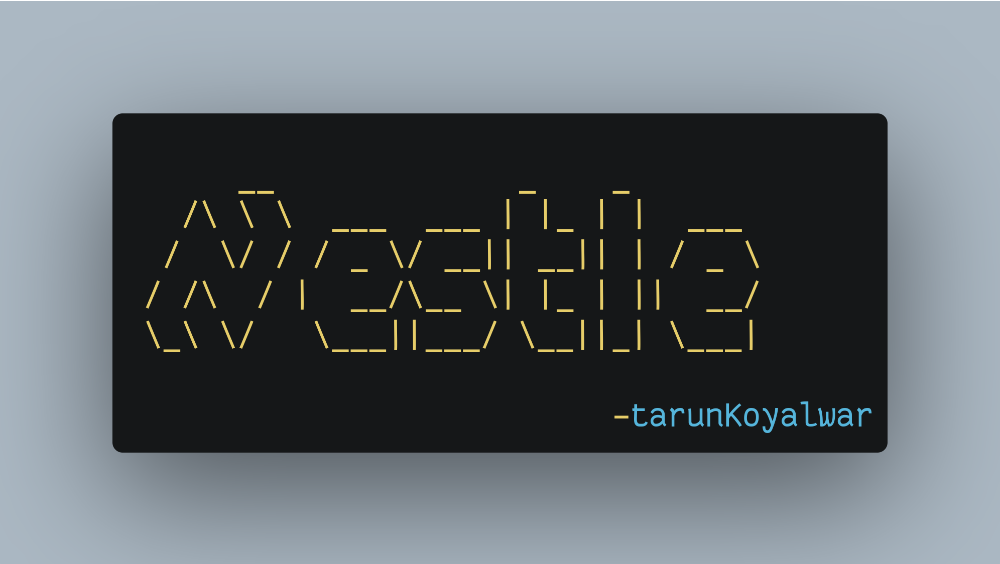

# Nestle

<p align="center" >

</br>
</p>


A simple and easy to use wrapper around **regex.Regexp** that allows parsing nested objected like brackets,parenthesis etc . The syntax to validate and match a nested group is `[{:nested:}]` this syntax or match group will validate and match balanced curly brackets.

## Why ??

There may be lot of cases where this can be used but **nestle** is primarily developed with a use case to extract embedded graphql queries from js files which traditionally is not easy and may not be possible due to nested object fields Ex `me { id address {street location }}`. However this can easily be matched and extracted using nestle .

### How does this work ??

Implementaion of `nestle` is simple it uses 2 regex instances one for regex before say `{` (Prematch group) and another instance for regex after `}` (PostMatch group) .Indexes of these two groups are obtained using `regexp.Regexp.FindAllStringIndex` and continuity and whether the parenthesis are balanced  is validated using a simple expression evaluation algorithm which uses **stack**

### Example/Usecase
Extract embedded graphql queries from javascript files 

~~~
cat js-file.js | nestle -regex '(query|mutation)\s+[a-zA-Z]+[0-9]*[a-zA-Z]+(\([^(\(|\))]+\))*\s*[{:nested:}]'
~~~

Above is 100% working example to extract entire graphql query . A sample graphql text file is located at [graphql.txt](./static/testcase_graphql.txt)

## Disclaimer

1. Nestle Only supports regex that have `:nested:` syntax since it is explicitly designed for this purposes .

2. Nestle currently does not support normal/other/simple regex since there are better options available.

3. Case where regex query only matches parenthesis ex: `[(:nested:)]` is discouraged and blacklisted 


## Installation 

- Install from source

```sh
go install -v github.com/tarunKoyalwar/nestle/cmd/nestle@latest
```

- Install from Releases


## Usage 

Using nestle with syntax `[:nested:]` . is simple which can be better understood using below example

**Example**

- Objective :  extract user data ` user {xxx} ` from below graphql query 

~~~
query me{
    me {
        id
        username
        user {
            address {
                street
                city
            }
            contact {
                email
                phone
            }
        }
    }
}
~~~

to extract `user {xxx}` including all data between them with parenthesis use regex

~~~
(user)\s+[{:nested:}]
~~~

and that's it . Here nested group is denoted using **[ start_char : nested : end_char ]**


Other examples are available in `nestle_test.go` file and a sample file is available at [graphql.txt](./static/testcase_graphql.txt)


Run below command for help

```sh
nestle -h
```


# Support

Do start the repo if you liked the project to keeep motivated  and create interesting projects